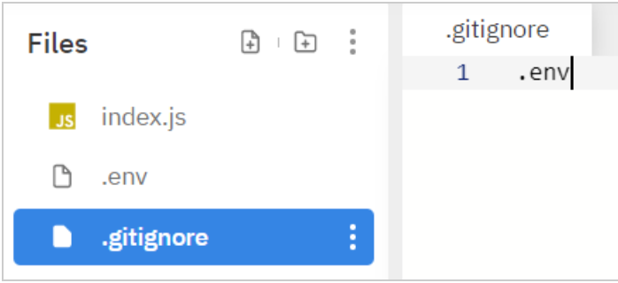
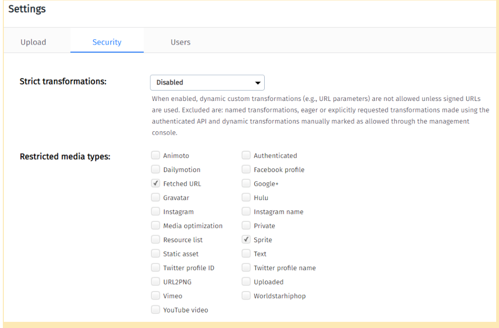
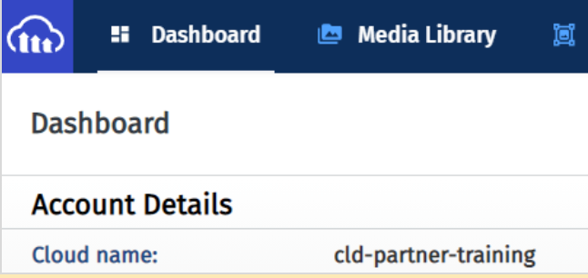

# Student Activity
## Prerequisites 

To perform the steps shown in the demonstrations within the course, you will need:  

1.      A free Cloudinary account. You can sign up for one here: https://cloudinary.com/users/register/free
2.      A GitHub account. This is required only if you want to clone or fork the imported repo. Otherwise, you can simply download the repo without a GitHub account, as long as the repo is public.
3.      A [repl.it](https://repli.it) account. This is optional. We have used repl.it for our demos, but you can choose any IDE (independent development environment) of your choice.   
However, the below steps are specifically for carrying out within repl.it.  
Source Code Repositories
 https://github.com/rebeccapeltz/cld-bd-video-upload  
https://github.com/cloudinary-training/cld-bd-product-gallery  

##  Importing GitHub Repos   
You will need two separate repl.it instances – one for the eCommerce web page, and another for the Uploader function.   

In one of the repl.it instances, import the eCommerce web page github repo, which includes the Product Gallery code. https://github.com/cloudinary-training/cld-bd-product-gallery  
To import the repo:  
In your repl.it account, click the New repl button on the top left.  
Select the Import from GitHub tab, as shown below.  
Copy-paste the repo link in the Paste any repository URL field.  

You can import the github repo of the uploader function: https://github.com/cloudinary-training/cld-bd-product-gallery by following the same steps (2a - 2c).  

## Note
The eCommerce web page is the front-end or the client-side, whereas the upload functionality is a back-end project which runs on node.js. Both projects can run JavaScript. Yet, the web page or browser JavaScript and the node.js server JavaScript each have some unique features. To put them both together in a single repl.it instance would require full stack functionality, which means that it can run from the server to the browser. 

### Setting up the Upload API (Uploader Function) in repl.it Environment  
Make sure you have imported the github repo of the uploader function: https://github.com/cloudinary-training/cld-bd-upload-media  

1. On the top of the left panel, click the Add file option.
2. Name the file .env.  
3. Navigate to your Cloudinary account.
4. Select the Dashboard tab on the top.  
5. Under Account Details, copy the API Environment variable. You can copy it by clicking the Copy to clipboard link adjacent to the variable.
6. Now, back in the uploader repl.it, select the .env file.
7. Paste the API Environment variable within the .env file.  

You should now be able to view your Cloudinary_URL which includes the API Key, API Secret and the cloud name of your account. Typically, it should look like this:

Then, select the Shell tab. 
Run npm i. The npm i command  installs the Cloudinary node.js SDK library and is required before running any scripts.
Finally, click the Run button on the top. It might take a few moments for the code to be executed. 
To review the response, click the Console tab next to the Shell tab.
Once done, visit your Cloudinary account once again to verify if the upload was successful. 

Note
If you want to fork this code, you must ensure that you don't accidentally check in the .env to your own GitHub. A way to do this is to add a .gitignore file and then add .env to it. The .gitignore file lists any files you don't want checked into Github, such as the .env. 
Given below is an example:

Setting up the Product Gallery repl.it Environment
Make sure you have imported the github repo of the Product Gallery: https://github.com/cloudinary-training/cld-bd-product-gallery. You can follow the instructions listed under the Importing GitHub repos section to import the repo.
On the left panel, click the index.html file.
Scroll down to the bottom of the page.
Examine the Product Gallery code snippet.
Notice the mediaAssets parameter that includes the tags and media type.
To preview the webpage with the video, either click the Run button on the top, or the Open in a new tab icon . 
To publish the video asset you uploaded in the product gallery:
Visit your Cloudinary DAM console/account.
Navigate to the account settings section.
Under the Security tab, de-select the Resource list checkbox as shown below.

Scroll to the bottom of the page and click Save.
Back in repl.it instance, change the cloudName field with the cloud name of your account. You can find the cloud name from your Cloudinary DAM account. Given below is an image for reference:

Delete the tag field that is used to retrieve image assets with the tag “position_1” from an account. Note that your account does not have images yet, hence this line is not needed. 
OPTIONAL: You can use the uploader method to upload images and then declare the tags you use while uploading the image assets. Your product gallery will then display the video asset as well as the images you upload to your cloud.

Additional Resources

[How to integrate Cloudinary into your application](https://cloudinary.com/documentation/how_to_integrate_cloudinary) 

[Upload API](https://cloudinary.com/documentation/image_upload_api_reference) 

[Uploading Assets](https://cloudinary.com/documentation/upload_images)  

[Upload Presets](https://cloudinary.com/documentation/upload_presets)  

[Product Gallery Demo](https://demo.cloudinary.com/product-gallery/)  

[Metadata API](https://cloudinary.com/documentation/metadata_api)  

[Eager Transformation](https://cloudinary.com/documentation/transformations_on_upload#eager_transformations)  

[Upload Widget API reference](https://cloudinary.com/documentation/upload_widget_reference) 

[Media Library](https://cloudinary.com/documentation/media_library_widget)  

[Product Gallery](https://cloudinary.com/documentation/product_gallery)  

[Product Gallery API](https://cloudinary.com/documentation/product_gallery_reference)  

[DOMContentLoaded event](https://developer.mozilla.org/en-US/docs/Web/API/Window/DOMContentLoaded_event)  

[Video Player](https://cloudinary.com/documentation/cloudinary_video_player)  

[Video transformation API](https://cloudinary.com/documentation/video_transformation_reference)  

[Video Player API](https://cloudinary.com/documentation/video_player_api_reference)  

[Video Player Studio](https://studio.cloudinary.com/)  

[Cloudinary SDKs](https://cloudinary.com/documentation/cloudinary_sdks)

