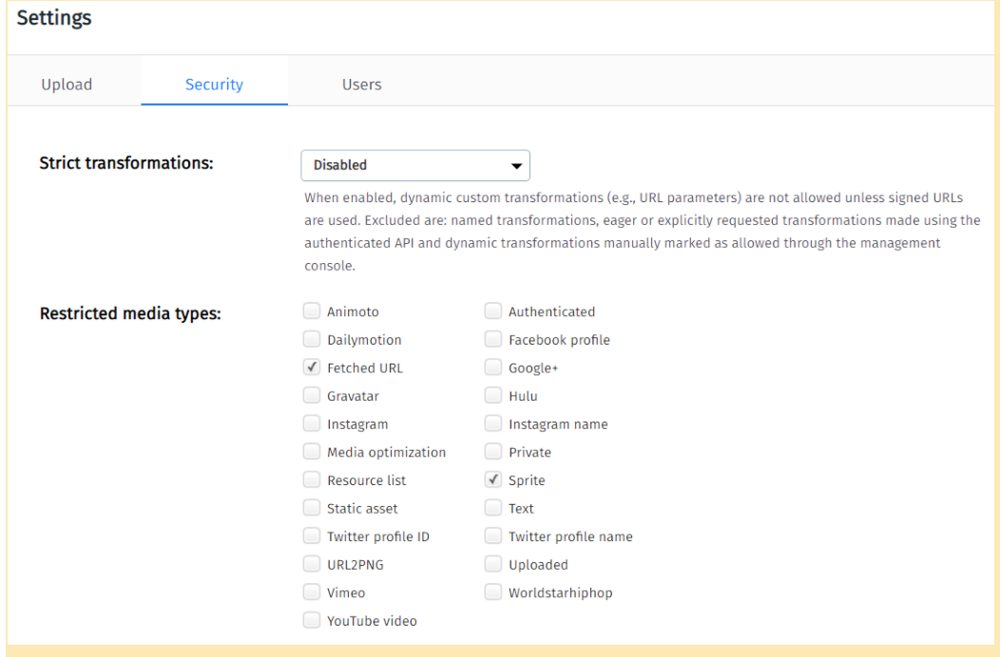
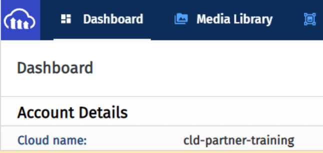

# Cloudinary Business Development Product Gallery

The instructions given below are solely with reference to the Partner training module "Using Videos on eCommerce Product Detail Pages".
Utilize these instructions to perform the steps demonstrated within the course.

## Prerequisites 

To perform the steps shown in the demonstrations within the course, you will need:  

1. A free Cloudinary account. You can sign up for one here: https://cloudinary.com/users/register/free
2. A GitHub account. This is required only if you want to clone or fork the imported repo. Otherwise, you can simply download the repo without a GitHub account, as long as the repo is public.
3. A [repl.it](https://repli.it) account. This is optional. We have used repl.it for our demos, but you can choose any IDE (independent development environment) of your choice.   
However, the below steps are specifically for carrying out within repl.it.    
You'll find the source for the Upload Video instruction in this repository.  You can find the instruction and code for uploading video to Cloudinary here: https://github.com/cloudinary-training/cld-bd-upload-media

##  Importing GitHub Repos   
You will need two separate repl.it instances – one for the eCommerce web page, and another for the Uploader function.   

In one of the repl.it instances, import the eCommerce web page GitHub repo, which includes the Product Gallery code. https://github.com/cloudinary-training/cld-bd-product-gallery  
To import the repo:    

a. In your repl.it account, click the New repl button on the top left.    
b. Select the Import from GitHub tab, as shown below.    
c. Copy-paste the repo link in the Paste any repository URL field.   


You can import the GitHub repo of the uploader function: https://github.com/cloudinary-training/cld-bd-product-gallery by following the same steps (2a - 2c).  

## Note
The eCommerce web page is the front-end or the client-side, whereas the upload functionality is a back-end project which runs on node.js. Both projects can run JavaScript. Yet, the web page or browser JavaScript and the node.js server JavaScript each have some unique features. To put them both together in a single repl.it instance would require full stack functionality, which means that it can run from the server to the browser. 


### Setting up the Product Gallery repl.it Environment
1. Make sure you have imported the GitHub repo of the Product Gallery: https://github.com/cloudinary-training/cld-bd-product-gallery. You can follow the instructions listed under the Importing GitHub repos section to import the repo.
2. On the left panel, click the index.html file.
3. Scroll down to the bottom of the page.
4. Examine the Product Gallery code snippet.
5. Notice the mediaAssets parameter that includes the tags and media type.
6. To preview the webpage with the video, either click the Run button on the top, or the Open in a new tab icon . 
7. To publish the video asset you uploaded in the product gallery:  
a. Visit your Cloudinary DAM console/account.  
b. Navigate to the account settings section.  
c. Under the Security tab, de-select the Resource list checkbox as shown below.  

  

d. Scroll to the bottom of the page and click Save.  
e. Back in repl.it instance, change the cloudName field with the cloud name of your account. You can find the cloud name from your Cloudinary DAM account. Given below is an image for reference:



Here is the code that you will change so that you are serving the media that you uploaded.  Change `cld-partner-training` to your Cloudinary **Cloud Name**.

```JavaScript
 document.addEventListener("DOMContentLoaded", event => {
              cloudinary.galleryWidget({
                container: '#wrap',
                cloudName: 'cld-partner-training',
                mediaAssets: [
                  {
                    tag: "position_1", mediaType: "video", transformation: {
                      fetch_format: "auto",
                      transformation: { quality: "auto" }
                    }
                  },
                  {
                    tag: "position_1", transformation: {
                      fetch_format: "auto",
                      transformation: { quality: "auto" }
                    } 
                  }
                ],
                carouselStyle: 'thumbnails',
                displayProps: {
                  mode: 'expanded',
                  columns: 1,
                  spacing: 15
                },

              }).render();
            });
```

### Additional Resources

[How to integrate Cloudinary into your application](https://cloudinary.com/documentation/how_to_integrate_cloudinary) 

[Upload API](https://cloudinary.com/documentation/image_upload_api_reference) 

[Uploading Assets](https://cloudinary.com/documentation/upload_images)  

[Upload Presets](https://cloudinary.com/documentation/upload_presets)  

[Product Gallery Demo](https://demo.cloudinary.com/product-gallery/)  

[Metadata API](https://cloudinary.com/documentation/metadata_api)  

[Eager Transformation](https://cloudinary.com/documentation/transformations_on_upload#eager_transformations)  

[Upload Widget API reference](https://cloudinary.com/documentation/upload_widget_reference) 

[Media Library](https://cloudinary.com/documentation/media_library_widget)  

[Product Gallery](https://cloudinary.com/documentation/product_gallery)  

[Product Gallery API](https://cloudinary.com/documentation/product_gallery_reference)  

[DOMContentLoaded event](https://developer.mozilla.org/en-US/docs/Web/API/Window/DOMContentLoaded_event)  

[Video Player](https://cloudinary.com/documentation/cloudinary_video_player)  

[Video transformation API](https://cloudinary.com/documentation/video_transformation_reference)  

[Video Player API](https://cloudinary.com/documentation/video_player_api_reference)  

[Video Player Studio](https://studio.cloudinary.com/)  

[Cloudinary SDKs](https://cloudinary.com/documentation/cloudinary_sdks)


